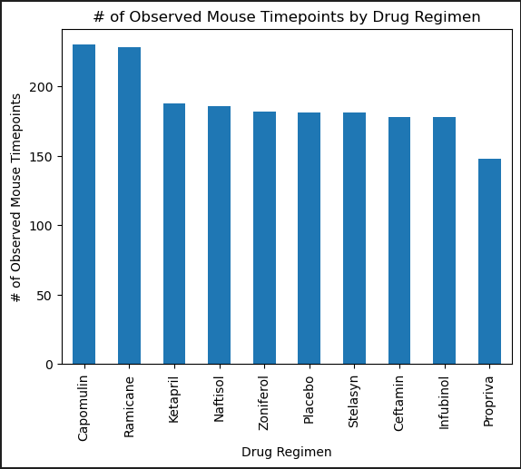
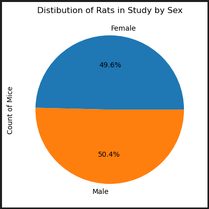
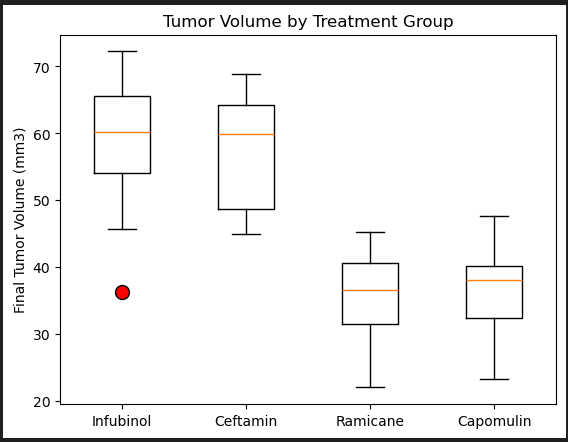
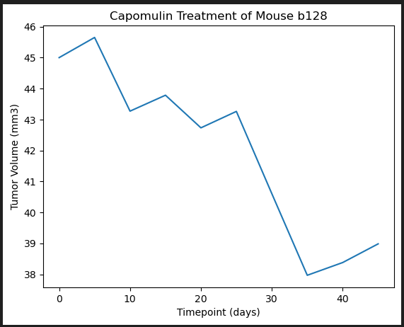
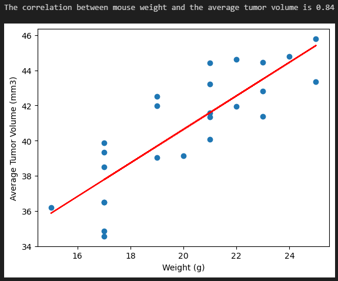

# Module 5: matplotlib_challenge

## The Task
You've just joined Pymaceuticals, Inc., a new pharmaceutical company that specializes in anti-cancer medications. Recently, it began screening for potential treatments for squamous cell carcinoma (SCC), a commonly occurring form of skin cancer.

As a senior data analyst at the company, you've been given access to the complete data from their most recent animal study. In this study, 249 mice who were identified with SCC tumors received treatment with a range of drug regimens. Over the course of 45 days, tumor development was observed and measured. The purpose of this study was to compare the performance of Pymaceuticals’ drug of interest, Capomulin, against the other treatment regimens.

The executive team has tasked you with generating all of the tables and figures needed for the technical report of the clinical study. They have also asked you for a top-level summary of the study results.

## User Story
```md
AS A data analyst for a pharmaceutical company
I WANT to analyze medical data and generate visualizations
SO THAT a technical report of the clinical study can be made.
```

## Acceptance Criteria
```md
Prepare the Data
  * The datasets are merged into a single DataFrame.
  * The number of mice are shown from the merged DataFrame.
  * Each duplicate mice is found based on the Mouse ID and Timepoint.
  * A clean DataFrame is created with the dropped duplicate mice.
  * The number of mice are shown from the clean DataFrame.

Generate Summary Statistics
  * The mean of the tumor volume for each regimen is calculated using groupby.
  * The media of the tumor volume for each regimen is calculated using groupby.
  * The variance of the tumor volume for each regimen is calculated using groupby.
  * The standard deviation of the tumor volume for each regimen is calculated using groupby.
  * The SEM of the tumor volume for each regimen is calculated using groupby.
  * A new DataFrame is created with using the summary statistics.

Create Bar Charts and Pie Charts
  * A bar plot showing the total number of timepoints for all mice tested for each drug regimen using Pandas is generated.
  * A bar plot showing the total number of timepoints for all mice tested for each drug regimen using pyplot is generated.
  * A pie chart showing the distribution of unique female versus male mice using Pandas is generated.
  * A pie chart showing the distribution of unique female versus male mice using pyplot is generated.

Calculate Quartiles, Find Outliers, and Create a Box Plot
  * A DatFrame that has the last timepoint for each mouse ID is created using groupby.
  * The index of the DataFrame is reset.
  * Retrieve the maximum timepoint for each mouse.
  * The four treatment groups, Capomulin, Ramicane, Infubinol, and Ceftamin, are put in a list.
  * An empty list is created to fill with tumor volume data.
  * A for loop is used to display the interquartile range (IQR) and the outliers for each treatment group
  * A box plot is generated that shows the distribution of the final tumor volume for all the mice in each treatment group.

Create a Line Plot and a Scatter Plot
  * A line plot is generated that shows the tumor volume vs. time point for one mouse treated with Capomulin.
  * A scatter plot is generated that shows average tumor volume vs. mouse weight for the Capomulin regimen.

Calculate Correlation and Regression
  * The correlation coefficient and linear regression model are calculated for mouse weight and average tumor volume for the Capomulin regimen.
```

## Visualizations











## License
This project is licensed under the GNU General Public License v3.0.  
License Link:
https://www.gnu.org/licenses/gpl-3.0.en.html   
[](https://www.gnu.org/licenses/gpl-3.0)